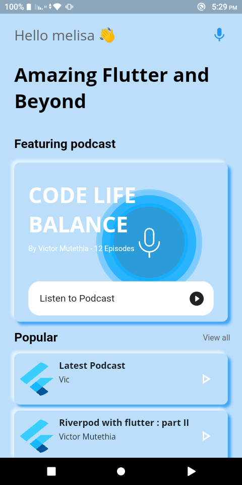
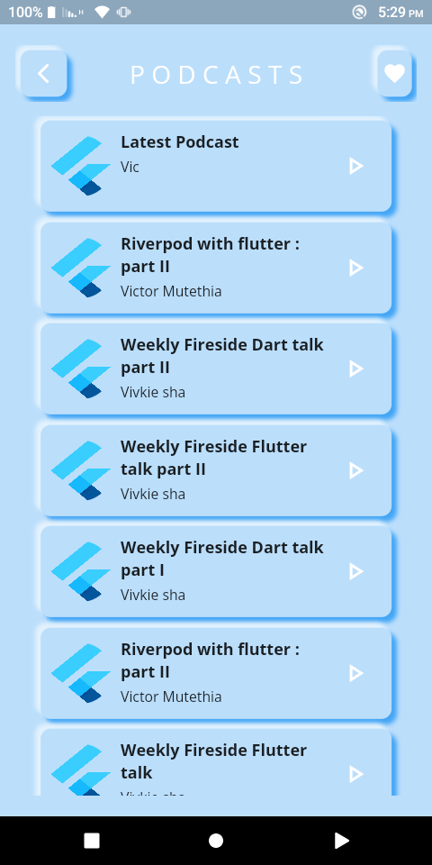
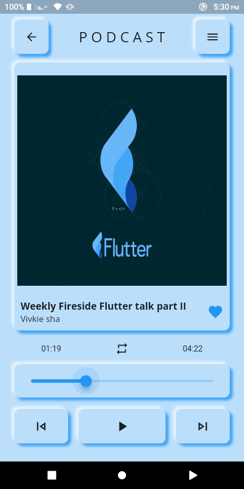
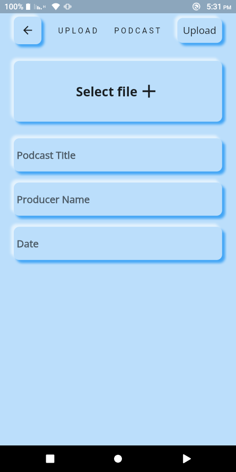
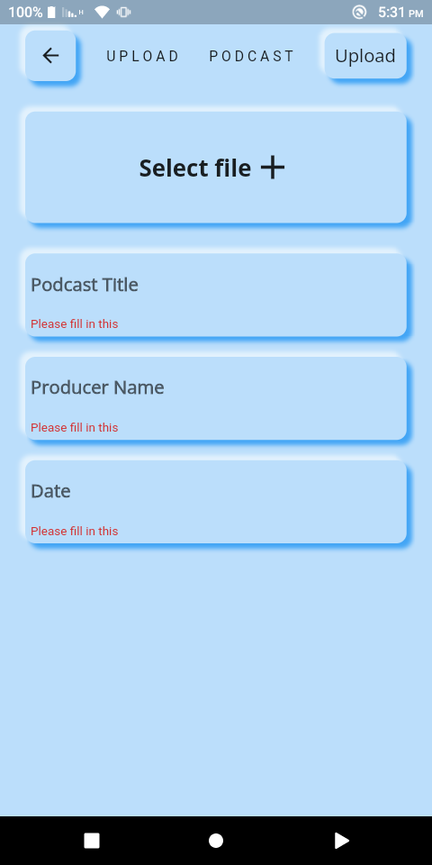
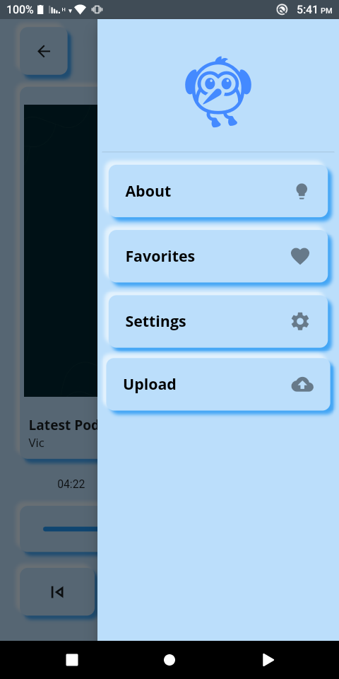

## pody
# Introduction

Pody is a neumorphic podcast app built with flutter and firebase.
Main packages used:
 ```dart
 firebase_storage - Storage and fetching of the podcast files
 ```
* Authenticated uses can access the notes any time they need.
* Save on space taken by the notes when stored locally.
* Students can access notes of previous semesters.

<div align="center">









</div>
