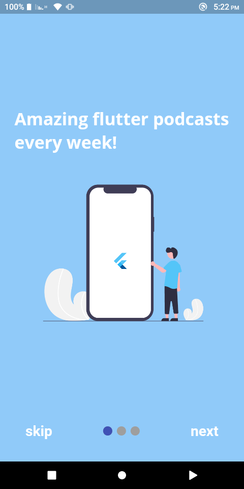

# pody
## Introduction

Pody is a neumorphic podcast app built with flutter and firebase.

Main packages used:
 ```dart
 firebase_storage - storage and fetching of the podcast files
 cloud_firestore - database for podcast information
 flutter_riverpod - state management
 audioplayers - playing audio podcast
 google_fonts - text styling
 ```
# Screenshots
<div align="center">




</div>
